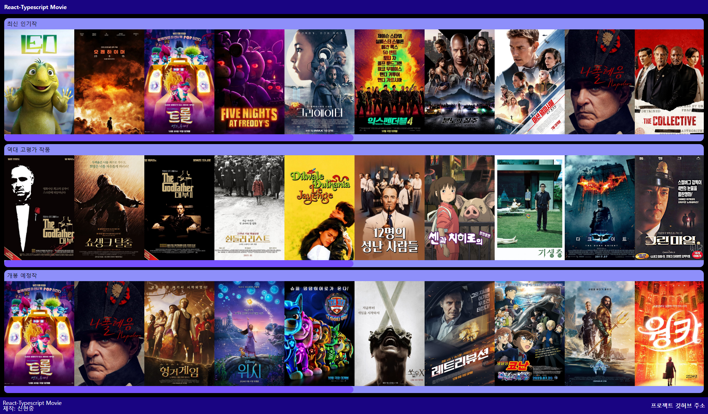
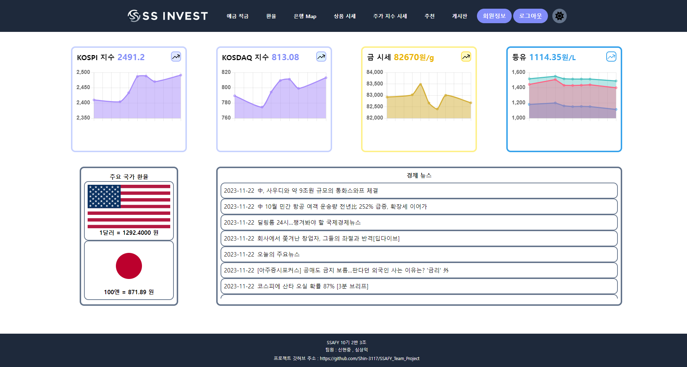

# portfolio
신현중의 portfolio 입니다

[https://shin-3117.github.io/portfolio/](https://portfolio-next-iota-ebon.vercel.app/)

## project

### JS_Shooting_game

HTML canvas 태그와 자바스크립트의 animate() 기능을 사용하여 만들었습니다.

<a href="https://shin-3117.github.io/JS_Shooting_game/" class="btn btn-primary"
target="_blank" rel="noreferrer noopener">플레이 하기</a>

깃허브 링크 : https://github.com/Shin-3117/JS_Shooting_game

### React-Typescript_Movie

Typescrip, React로 만든 영화 사이트 입니다.

깃허브 링크 : https://github.com/Shin-3117/React-Typescript_Movie

### Simple Support INVEST

투자를 위한 종합 정보 제공 사이트입니다. 

깃허브 링크 : https://github.com/Shin-3117/SSAFY_Team_Project
